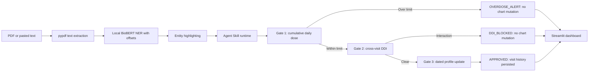

# MedHistory

[](LICENSE)


MedHistory is a local-first demonstration of a clinical prescription safety
workflow. It extracts text from PDF reports or accepts pasted clinical text,
detects medication and disease mentions with a supplied BioBERT
token-classification checkpoint, highlights exact character spans, checks
configured drug-drug interactions against a patient chart, and updates the
chart only when cumulative dose and cross-prescription interaction checks pass.

> **Clinical safety notice:** This hackathon prototype is not validated for
> clinical use, diagnosis, or treatment decisions. Its interaction list is
> intentionally limited, and it can miss entities or interactions. The supplied
> checkpoint uses generic class labels; confirm their mapping against the
> training metadata before relying on extraction results. A result of
> `APPROVED` means only that no configured rule matched.

## Architecture



The skill manifest and supporting files live under
`.agents/skills/medhistory-audit/`. Its workflow follows the Agent Skill Open
Standard layout: a `SKILL.md` manifest with YAML frontmatter, executable scripts,
reference rules, and patient assets.

The model is a local, open-weight BioBERT-derived token-classification
checkpoint, fine-tuned on BC5CDR according to the supplied model context.
The model directory is `model/biobert-ner-final/`. Git ignores the 411 MiB
`model.safetensors` file to avoid GitHub's file-size limit. Obtain the matching
weight artifact from the checkpoint provider used by your team or evaluator,
then download, copy, or mount it at exactly:

```text
model/biobert-ner-final/model.safetensors
```

For example, copy it from mounted storage in PowerShell:

```powershell
Copy-Item "E:\model-artifacts\model.safetensors" `
  "model\biobert-ner-final\model.safetensors"
```

Keep `config.json`, `tokenizer.json`, `tokenizer_config.json`, and the local
`README.md` beside the weights. Inference does not download weights at runtime.
Verify the artifact matches this checkpoint and review model/training-data
licenses before use or redistribution. Once provisioned, offline inference
keeps report text on the local machine.

## Requirements

- Python 3.10 or newer
- The local checkpoint files under `model/biobert-ner-final/`
- pypdf for PDF text extraction
- reportlab for sample PDF generation
- PyTorch-compatible runtime (CPU inference is supported; GPU is optional)

## Quickstart

Install the root project dependencies from the repository root:

```powershell
python -m venv .venv
.\.venv\Scripts\Activate.ps1
python -m pip install --upgrade pip
python -m pip install -r requirements.txt
python generate_sample_pdf.py
python create_conflict_test_pdfs.py
```

On macOS or Linux, activate with `source .venv/bin/activate` instead.

Place the matching model weights in `model/biobert-ner-final/` before running
either inference path.

## Command-line workflow

Extract entities from pasted text or a generated PDF (the model directory
defaults to the normalized path shown above):

```powershell
python .agents/skills/medhistory-audit/scripts/extract_entities.py `
  --text "Patient reports headache. Prescribe Aspirin 325mg twice daily."
```

```powershell
python .agents/skills/medhistory-audit/scripts/extract_entities.py `
  --pdf-path test_samples/conflict_sample.pdf
```

The extraction JSON includes exact `start` and `end` offsets for each entity,
as well as the original text and unique drug/disease arrays.

Pipe or save the extraction JSON, then pass it to the reconciliation runner. A
JSON file path and an inline JSON string are both accepted:

```powershell
python .agents/skills/medhistory-audit/scripts/audit_safety.py `
  --patient-id P101 `
  --extracted-json extracted.json
```

The CLI emits one JSON result on stdout. Errors are written to stderr and return
a nonzero exit code. `OVERDOSE_ALERT` and `DDI_BLOCKED` do not modify patient
profiles. `APPROVED` appends a visit with an ISO timestamp and updates active
medication records in the persistent JSON database.

## Multi-visit reconciliation

Every extracted medication includes its strength and calculated daily mg when
the note provides a recognizable amount and frequency. The safety runner first
sums new and active daily doses against the ceilings in
`.agents/skills/medhistory-audit/references/ddi_rules.json` (including
Paracetamol/Acetaminophen 4,000 mg/day, Aspirin 4,000 mg/day, Ibuprofen 2,400
mg/day, Metformin 2,550 mg/day, and Warfarin 10 mg/day). It then checks new
medications against previously active medications for configured DDIs.

An `OVERDOSE_ALERT` or `DDI_BLOCKED` result leaves the patient JSON byte-for-byte
unchanged. An `APPROVED` result stores a dated visit and appends structured
medication records with `status: ACTIVE`, dosage text, and daily mg to the
patient's `active_medications`; `audit_history` records the visit decision.
Legacy string medication entries remain readable and migrate to structured
records on approval. Every submitted PDF or pasted note runs against the
selected patient's persistent JSON profile. The sidebar shows active
medications and the visit timeline, supports creating a new profile, and keeps
two sample-note loaders; these loaders only fill the input and do not bypass
the audit action. No synthetic visits or simulation-only mutations are used.

## Streamlit dashboard

From the project root, run:

```powershell
streamlit run app.py
```

Choose P101 or P102, upload a PDF or paste clinical text, and select **Run
BioBERT NER & Clinical Safety Audit**. The sidebar includes a Warfarin/Aspirin
conflict example and a Paracetamol example. The dashboard invokes the same
local extraction and deterministic audit scripts used by the CLI.

The Open Standard skill directory is `.agents/skills/medhistory-audit/`:

- `SKILL.md`: manifest, workflow, compatibility, and safety policy.
- `scripts/`: local entity extraction and deterministic reconciliation.
- `references/ddi_rules.json`: configured interaction reference data.
- `assets/patients/`: mock patient profiles used by the demo.

`generate_sample_pdf.py` writes `conflict_sample.pdf` and `safe_sample.pdf`
under `test_samples/`; `create_conflict_test_pdfs.py` creates the additional
cross-prescription and same-note DDI fixtures there. Both generators resolve
paths from their own location, so they can be run from any current directory.

### External Agent Invocation

Cursor, Claude Code, Codex, and other compatible developer agents should first
read `.agents/skills/medhistory-audit/SKILL.md`, then invoke the extraction CLI
with `--text` or `--pdf-path`, followed by the audit CLI with the patient ID and
extraction JSON. Agents must not edit patient JSON directly or proceed after a
`BLOCKED` result; only an `APPROVED` result authorizes the safety runner to
persist the visit.

## Rule set and extension

The configured high-severity examples are stored in
`.agents/skills/medhistory-audit/references/ddi_rules.json`. Each rule has a
canonical drug pair, severity, risk, and mechanism. Add clinically reviewed
rules there before using them in a demonstration. The engine compares pair
members without case sensitivity and recognizes a canonical drug name followed
by a strength or dosage suffix.

For the supplied checkpoint, `config.json` exposes `LABEL_0` through `LABEL_4`.
The extractor currently assumes those map to `O`, `B-DRUG`, `I-DRUG`,
`B-DISEASE`, and `I-DISEASE`, respectively. This is a convention, not a fact
encoded in the checkpoint configuration; verify it against the model's label
encoder/training metadata. Prefer named BIO labels in a correctly configured
checkpoint.

## Scientific References

- Lee, J. et al. “BioBERT: a pre-trained biomedical language representation
  model for biomedical text mining.” *Bioinformatics* 36(4), 1234–1240 (2020).
  [doi:10.1093/bioinformatics/btz682](https://doi.org/10.1093/bioinformatics/btz682)
- Li, J. et al. “BioCreative V CDR task corpus: a resource for chemical disease
  relation extraction.” *Database* (Oxford), 2016, baw068.
  [doi:10.1093/database/baw068](https://doi.org/10.1093/database/baw068)