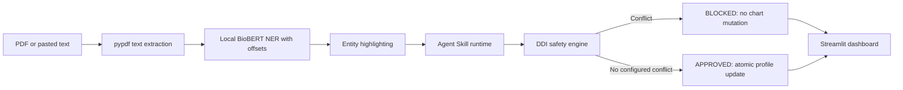

# MedHistory

MedHistory is a local-first demonstration of a clinical prescription safety
workflow. It extracts text from PDF reports or accepts pasted clinical text,
detects medication and disease mentions with a supplied BioBERT
token-classification checkpoint, highlights exact character spans, checks
configured drug-drug interactions against a patient chart, and updates the
chart only when no configured interaction is found.

> **Clinical safety notice:** This hackathon prototype is not validated for
> clinical use, diagnosis, or treatment decisions. Its interaction list is
> intentionally limited, and it can miss entities or interactions. The supplied
> checkpoint uses generic class labels; confirm their mapping against the
> training metadata before relying on extraction results. A result of
> `APPROVED` means only that no configured rule matched.

## Architecture



The skill manifest and supporting files live under
`.agents/skills/medhistory-audit/`. Its workflow follows the Agent Skill Open
Standard layout: a `SKILL.md` manifest with YAML frontmatter, executable scripts,
reference rules, and patient assets.

The model is a local, open-weight BioBERT-derived token-classification
checkpoint, fine-tuned on BC5CDR according to the supplied model context.
The model directory is `model/biobert-ner-final/`. The large weight file is
excluded from Git; download it from the checkpoint's source or mount/copy it
from local or external storage into that directory. Keep `config.json`,
`tokenizer.json`, and `tokenizer_config.json` beside the weights. Inference then
uses those local files and does not download model weights at runtime. Check
the checkpoint and training-data licenses and provenance before redistribution
or use. Offline inference keeps report text on the local machine after
dependencies and weights are installed.

## Requirements

- Python 3.10 or newer
- The local checkpoint files under `model/biobert-ner-final/`
- pypdf for PDF text extraction
- reportlab for sample PDF generation
- PyTorch-compatible runtime (CPU inference is supported; GPU is optional)

Install the root project dependencies:

```powershell
python -m venv .venv
.\.venv\Scripts\Activate.ps1
python -m pip install --upgrade pip
python -m pip install -r requirements.txt
python generate_sample_pdf.py
```

On macOS or Linux, activate with `source .venv/bin/activate` instead.

## Command-line workflow

Extract entities from pasted text or a generated PDF (the model directory
defaults to the normalized path shown above):

```powershell
python .agents/skills/medhistory-audit/scripts/extract_entities.py `
  --text "Patient reports headache. Prescribe Aspirin 325mg twice daily."
```

```powershell
python .agents/skills/medhistory-audit/scripts/extract_entities.py `
  --pdf-path test_samples/conflict_sample.pdf
```

The extraction JSON includes exact `start` and `end` offsets for each entity,
as well as the original text and unique drug/disease arrays.

Pipe or save the extraction JSON, then pass it to the reconciliation runner. A
JSON file path and an inline JSON string are both accepted:

```powershell
python .agents/skills/medhistory-audit/scripts/audit_safety.py `
  --patient-id P101 `
  --extracted-json '{"raw_text":"Prescribe Aspirin","extracted_drugs":["Aspirin"],"extracted_diseases":[]}'
```

The CLI emits one JSON result on stdout. Errors are written to stderr and return
a nonzero exit code. `BLOCKED` results do not modify the patient profile;
`APPROVED` results append newly extracted medication mentions and a UTC audit
entry. The two bundled patient files are demonstration fixtures and are changed
by approved CLI runs.

## Streamlit dashboard

From the project root, run:

```powershell
streamlit run app.py
```

Choose P101 or P102, upload a PDF or paste clinical text, and select **Run
BioBERT NER & Clinical Safety Audit**. The sidebar includes a Warfarin/Aspirin
conflict example and a Paracetamol example. The dashboard invokes the same
local extraction and deterministic audit scripts used by the CLI.

The Open Standard skill directory is `.agents/skills/medhistory-audit/`:

- `SKILL.md`: manifest, workflow, compatibility, and safety policy.
- `scripts/`: local entity extraction and deterministic reconciliation.
- `references/ddi_rules.json`: configured interaction reference data.
- `assets/patients/`: mock patient profiles used by the demo.

`generate_sample_pdf.py` writes `conflict_sample.pdf` and `safe_sample.pdf`
under `test_samples/` for the PDF workflow.

## Rule set and extension

The configured high-severity examples are stored in
`.agents/skills/medhistory-audit/references/ddi_rules.json`. Each rule has a
canonical drug pair, severity, risk, and mechanism. Add clinically reviewed
rules there before using them in a demonstration. The engine compares pair
members without case sensitivity and recognizes a canonical drug name followed
by a strength or dosage suffix.

For the supplied checkpoint, `config.json` exposes `LABEL_0` through `LABEL_4`.
The extractor currently assumes those map to `O`, `B-DRUG`, `I-DRUG`,
`B-DISEASE`, and `I-DISEASE`, respectively. This is a convention, not a fact
encoded in the checkpoint configuration; verify it against the model's label
encoder/training metadata. Prefer named BIO labels in a correctly configured
checkpoint.